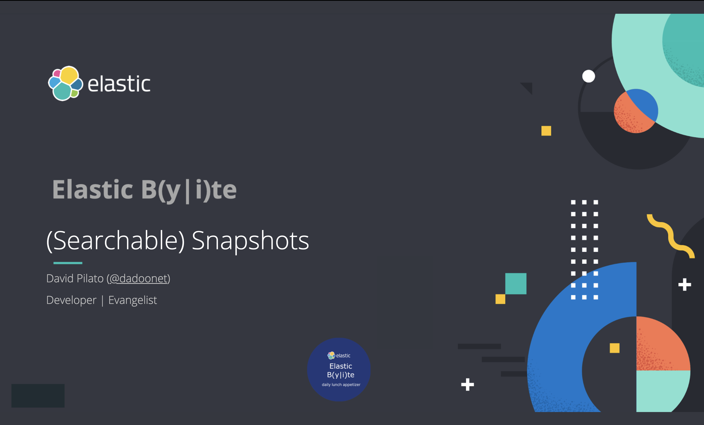

# Demo scripts used for Elastic Daily Bytes - Searchable Snapshots



## Setup

You first need to [create a Google Cloud Storage bucket](https://www.elastic.co/guide/en/elasticsearch/plugins/current/repository-gcs-usage.html#repository-gcs-creating-bucket) to hold the snapshots. It must be named `elastic-daily-bytes`.
Then [create a service account](https://www.elastic.co/guide/en/elasticsearch/plugins/current/repository-gcs-usage.html#repository-gcs-using-service-account) and download the json service file to `elasticsearch-config/service-account.json`.

The setup will check that Elasticsearch and Kibana are running.

It will also add Kibana Canvas slides.

### Run on cloud (recommended)

Open your cloud deployment in the [cloud console](https://cloud.elastic.co/deployments) and 
open the security tab. Click on `Add settings` near the "Elasticsearch keystore".

Add the setting `gcs.client.demo.credentials_file` as a "JSON/Block file" and copy/paste the content of 
`elasticsearch-config/service-account.json` in it. Then click "Save".

You also need to edit your cluster `elasticsearch.yml` file and add to one of the tier the following setting:

```yml
xpack.searchable.snapshot.shared_cache.size: 15gb
```

This will allocate 15gb of disk as a cache for frozen snapshots.


This specific configuration is used to run the demo on a [cloud instance](https://cloud.elastic.co).
You need to create a `.cloud` local file which contains:

```
CLOUD_ID=the_cloud_id_you_can_read_from_cloud_console
CLOUD_PASSWORD=the_generated_elastic_password
```

Run:

```sh
./setup.sh
```

### Run Locally (NOT SUPPORTED FOR THIS DEMO)

Run Elastic Stack:

```sh
docker-compose down -v
docker-compose up --build
```

And run:

```sh
./setup.sh
```

## Demo part


